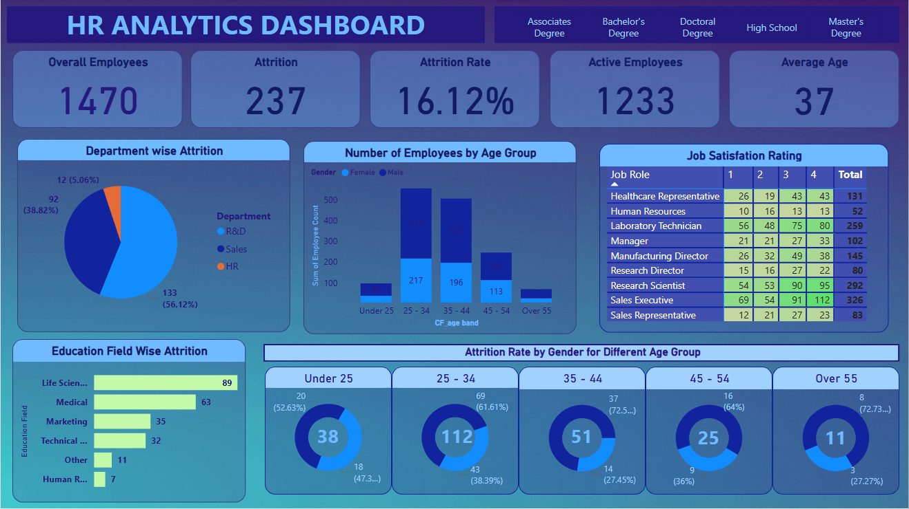

# HR Attrition Analysis Dashboard 📊

## 📌 Project Overview
This project analyzes employee attrition using HR data to identify key factors affecting employee turnover.
The analysis is performed using **Excel** for data preparation and **Power BI** for interactive visualization.

---

## 📂 Dataset Details
- Source: HR Employee Dataset
- Records include:
  - Attrition
  - Age
  - Gender
  - Department
  - Job Role
  - Education
  - Salary
  - Years at Company
  - Work-Life Balance
  - Performance Rating

---

## 🛠 Tools Used
- Microsoft Excel (Data Cleaning & Preparation)
- Power BI (Dashboard & Visual Analysis)
- GitHub (Project Hosting)

---

## 📊 Power BI Dashboard Insights
- Attrition rate comparison between current and ex-employees
- Department-wise and Job Role-wise attrition
- Impact of salary, age, and experience on attrition
- Relationship between work-life balance and attrition

---

## 🖼 Dashboard Preview

---

## 🚀 How to Use
1. Download the Excel dataset from the `data` folder
2. Open `.pbix` file using Power BI Desktop
3. Explore interactive filters and visuals

---

## 👤 Author
**Shubham Mandavkar**  
Aspiring Data Analyst | Excel | Power BI | SQL | Python
